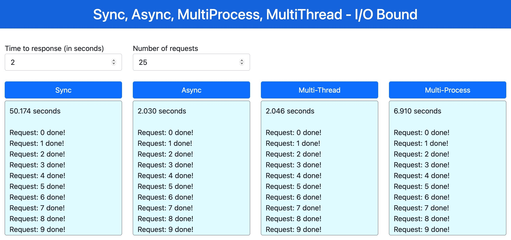
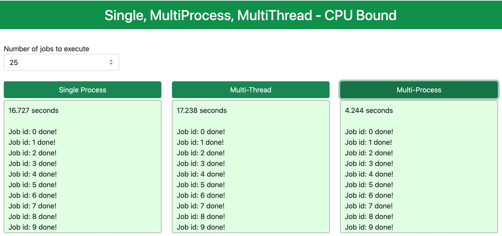

# Comparing sync, async/await, multi-threading, multi-processing (I/O and CPU tasks)

This repository show the code to implement and compare the results between those concepts.

Here we simulate two scenarios:
- <b>I/O Bound</b>: this simulate the situation where we are performing several requests on another service API. This way our service is consuming another service, i.e, our server do not perform CPU intense task, just wait for the responses.
- <b>CPU Bound</b>: this simulate the situation where the server has to perform a heavy workload process. This way our server is being consumed by another service, i.e, our server is perform CPU intense task.

With those two scenarios we can see how thos different kind of techiniques are better than others.

Hope with this application you can decide what approach to use in different situations.


## Demo




## Overview of the code
- [web-app/client.py](web-app/client.py): show the Web UI.
- [web-server/server.py](web-server/server.py): simulate those two sceneraios: one serving an easy task (I/O bound) and other serving a heavy task (CPU Bound)


## Services available
#### Parameters Description
- <b>sleep (int)</b>: in easy task simulate a small response time from the server. Default is 2 seconds.
- <b>n_requests (int)</b>: in easy task define how many requests to perform.
- <b>n_jobs (int)</b>: in heavy task define how many time the CPU intense function will be executed. 

| Endpoint | Method | Description
| --- | --- | --- |
| http://localhost/   | GET  | Webapp
| http://localhost/easy_sync/   | POST  | Receive a json with "sleep: int" and "n_requests: int" and perform "n_requests" requests. Each request will last "sleep" seconds (to simulate a easy workload)
| http://localhost/easy_async/   | POST  | Receive a json with "sleep: int" and "n_requests: int" and perform "n_requests" async requests. Each request will last "sleep" seconds (to simulate a easy workload)
| http://localhost/easy_multiprocess/   | POST  | Receive a json with "sleep: int" and "n_requests: int" and perform "n_requests" requests. Each request will start a new process and will last "sleep" seconds (to simulate a easy workload)
| http://localhost/easy_multithread/   | POST  | Receive a json with "sleep: int" and "n_requests: int" and perform "n_requests" requests. Each request will start a new thread and  will last "sleep" seconds (to simulate a easy workload)
| http://localhost/heavy_single/   | POST  | Receive a json with "n_jobs: int". Each request will execute "n_jobs" the CPU intense task. All tasks will be executed in a single process.
| http://localhost/heavy_thread/   | POST  | Receive a json with "n_jobs: int". Each request will execute "n_jobs" the CPU intense task. All tasks will be spread across several threads.
| http://localhost/heavy_process/   | POST  | Receive a json with "n_jobs: int". Each request will execute "n_jobs" the CPU intense task. All tasks will be spread across several process.


## Install
1. Clone this repository
```bash
git clone https://github.com/renatoviolin/Deploying-YOLOv5-fastapi-celery-redis-rabbitmq.git
cd Deploying-YOLOv5-fastapi-celery-redis-rabbitmq
```

2. Install packages
```bash
pip install -r requirements.txt
```

3. Start the web-server
```bash
cd web-server
uvicorn server:app --host 0.0.0.0 --port 8000 &
```

4. Start the web-app
```bash
cd ../web-app
uvicorn client:app --host 0.0.0.0 --port 80 &
```

5. Open your browser
http://localhost